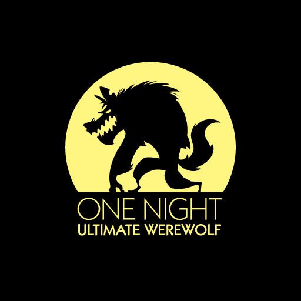

# /onenight

Play [One Night Ultimate Werewolf](http://beziergames.com/collections/all-uw-titles/products/one-night-ultimate-werewolf)
right in the comfort of your Slack channel.

## Development

### Requirements

- Python 3.5

## License

[MIT](https://marksteve.mit-license.org)
